# Hackathon Command Center 🚀

### Orchestrate by Instinct.

  

**Hackathon Command Center** is a **Generative UI** dashboard powered by AI, designed to transform how hackathon events are managed. It abandons static admin panels for a dynamic, conversation-driven interface that adapts in real-time to the user's role and the event's lifecycle.

Built with **Next.js 15**, **Framer Motion**, and **Tailwind CSS**, it features a premium "Linear-style" aesthetic and a powerful AI assistant that acts as the central nervous system of the event.

---

## ✨ Key Features

### 🧠 Generative UI Engine
The interface isn't static. It morphs based on context.
- **Dynamic Widgets**: Components like `JudgingQueue`, `Timeline`, and `ProjectStatusCard` appear and update strictly when relevant.
- **Context-Aware Layouts**: The dashboard restructures itself depending on whether you are an Organizer, Judge, or Participant.

### 🔐 Role-Based Access Control (RBAC)
Secure, role-specific environments ensure data integrity.
- **Strict Permissions**: Participants cannot access judging tools; Judges cannot alter event phases.
- **PIN Authentication**: Switching to privileged roles requires secure PIN verification.

### 🤖 Tambo AI Assistant
A context-aware AI integrated directly into the workflow.
- **User Isolation**: Every device/browser gets a unique, isolated chat session. New users never see old threads.
- **Smart Actions**: Type *"Change phase to Judging"* or *"Show me the queue"* to trigger UI changes instantly.
- **Persistent History**: Chat threads are saved efficiently for the active user.

---

## 🎭 Roles & Capabilities

The application supports three distinct roles, each with specific restrictions and capabilities.

### 1. 👑 Organizer (God Mode)
The event architect. Fully unrestricted access.
- **Capabilities**: 
    - Advance event phases (Registration -> Submission -> Judging -> Results).
    - View all dashboards and metrics.
    - Override logic and force state changes.
- **Access**: Requires PIN **`9999`**.

  


### 2. ⚖️ Judge (Review Mode)
Focused purely on evaluating submissions.
- **Capabilities**:
    - Access the `JudgingQueue`.
    - View submission details (Members, Links, Descriptions).
    - Submit scores (Approved/Rejected/Pending).
- **Restrictions**: Cannot change event phases or see other judges' scores.
- **Access**: Requires PIN **`5555`**.

  


### 3. 👤 Participant (User Mode)
The default view for hackers.
- **Capabilities**:
    - View global `Timeline` and `Countdown`.
    - Check their own **Project Status** (Reviewed/Pending).
    - Query the AI about team details ("What is the status of team DataDrifters?").
    - Query the AI about project details ("I am Mohit Jeswani What is the status of my project?").
- **Restrictions**: Read-only access to event data.

  


---

## 🚀 Event Lifecycle Phases

 The system moves through 4 strict phases, controlled by the Organizer:

1.  **Registration**: Users sign up; countdown to hacking start.
2.  **Submission**: Hacking in progress; project submission enabled.
3.  **Judging**: Submissions lock. Judges access the Queue.
4.  **Results**: Winners announced; final scoreboard displayed.

---

## 🛠️ Tech Stack

- **Framework**: [Next.js 15](https://nextjs.org/) (App Router)
- **Styling**: [Tailwind CSS](https://tailwindcss.com/)
- **Animation**: [Framer Motion](https://www.framer.com/motion/)
- **State Management**: [Zustand](https://github.com/pmndrs/zustand)
- **AI Integration**: [Tambo AI](https://tambo.ai) (React SDK)
- **Icons**: [Lucide React](https://lucide.dev)

---

## � Application Flow & Role Architecture

```mermaid
graph TD
    Start[User Opens App] --> AI{Ask AI Assistant}
    
    AI -->|Switch Role| RoleCheck{PIN Verification}
    
    RoleCheck -->|PIN xxxx| Org[👑 Organizer Mode]
    RoleCheck -->|PIN xxxx| Jdg[⚖️ Judge Mode]
    RoleCheck -->|Default / No PIN| Part[👤 Participant Mode]
    
    subgraph Organizer Capabilities
    Org --> P1[Advance Event Phases]
    Org --> P2[Override Logic]
    Org --> P3[View All Metrics]
    end
    
    subgraph Judge Capabilities
    Jdg --> J1[Access Judging Queue]
    Jdg --> J2[Review Code/Links]
    Jdg --> J3[Submit Scores]
    end
    
    subgraph Participant Capabilities
    Part --> U1[View Timeline]
    Part --> U2[Check Project Status]
    Part --> U3[Query Team Details]
    end
```



---

## �🏗️ Getting Started

### Prerequisites
- Node.js 18+
- API Key from Tambo AI

### Installation

1.  **Clone the repository**
    ```bash
    git clone https://github.com/yourusername/hackathon-command-center.git
    cd hackathon-command-center
    ```

2.  **Install dependencies**
    ```bash
    npm install
    ```

3.  **Configure Environment**
    Create a `.env.local` file in the root directory:
    ```env
    NEXT_PUBLIC_TAMBO_API_KEY=your_tambo_api_key_here
    NEXT_PUBLIC_TAMBO_URL=https://api.tambo.ai/v1
    ```

4.  **Run the development server**
    ```bash
    npm run dev
    ```

5.  **Open the App**
    Navigate to [http://localhost:3000](http://localhost:3000).

---

## 🔮 Future Roadmap

### 🔌 Live Ecosystem Integrations
- **GitHub/GitLab Analysis**: Automatically pull commit history and language stats to verify work done during the event.
- **Devpost Sync**: Seamlessly export winners and project descriptions to external platforms.

### 🎙️ Voice Command Center
- **Hands-Free Control**: "Hey Admin, extend the deadline by 1 hour." Control the event while walking around the venue.

### 📊 Advanced Analytics
- **Participant Engagement**: Heatmaps of team activity and resource requests.

### 📡 Real-Time WebSockets
- Upgrade from polling to instant state synchronization for critical phase changes and announcements.

---

**Orchestrate by Instinct.**  
*Built for the future of hackathons.*
